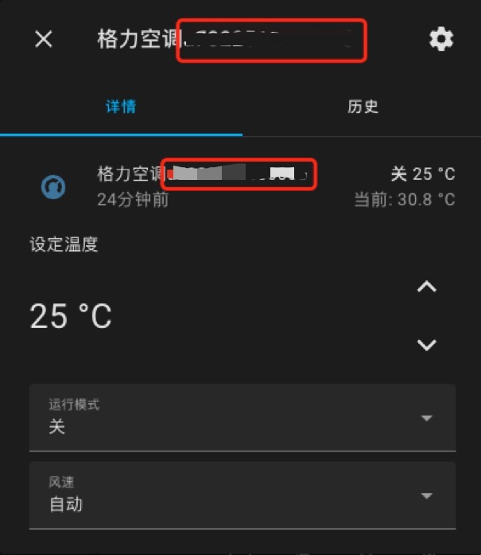
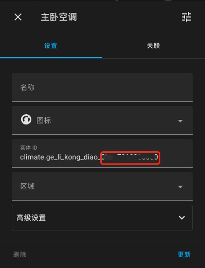
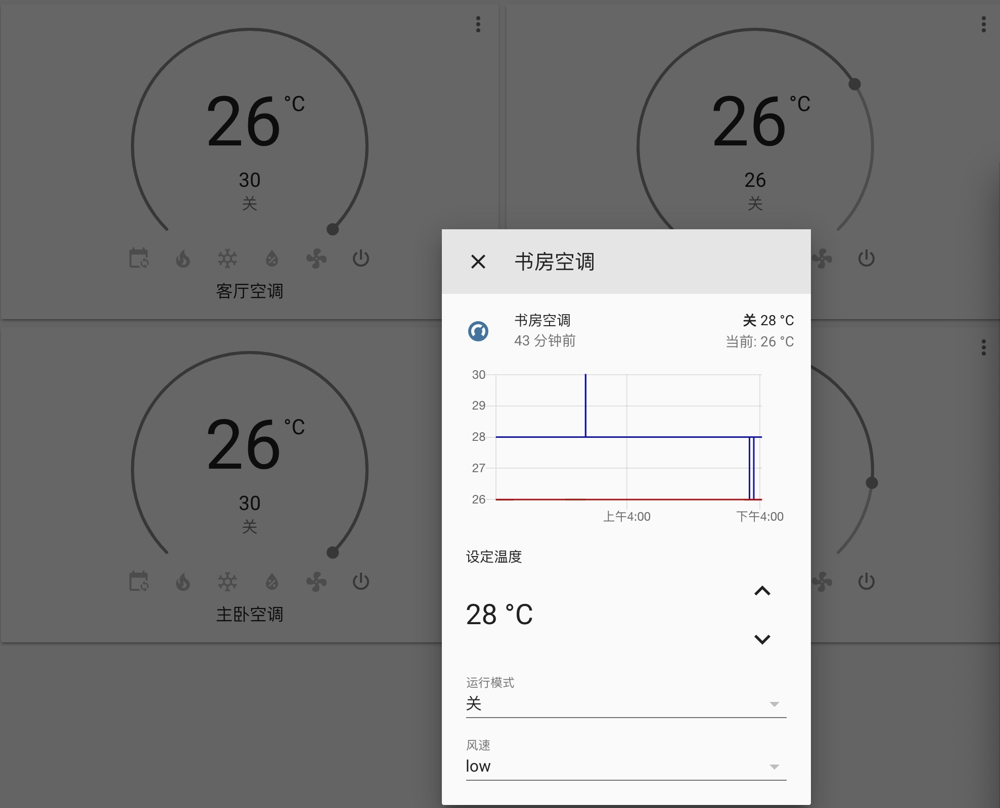

# Ha-GreeCentralClimate
格力中央空调Homeassistant插件，使用格力云控进行控制

gree2目录复制到custom_components，再在configuration.yaml中加上配置：

```
climate:
  - platform: gree2
```

使用scan_interval可以自定义同步时间：
```
climate:
  - platform: gree2
    scan_interval: 20
```

多个云控可以增加多个配置，不过需要事先从路由器里拿到云控的ip：

```
climate:
  - platform: gree2
    host: 192.168.1.100
    scan_interval: 20
  - platform: gree2
    host: 192.168.5.101
    scan_interval: 20
```

由于无法通过云控获得空调内置传感器温度，原本写死26度，现支持引入其他温度传感器展示到空调面板:

```
climate:
  - platform: gree2
     temp_sensor:
       climate_mac_1: sensor_entity_id_1
       climate_mac_2: sensor_entity_id_2
```

```climate_mac``` 为空调名称格力空调后的一串子母数字，做过名称自定义的可能看不到，但是可以找到空调实体ID的最后一段，```sensor_entity```为温度传感器的实体ID```entity_id```

<center>
	
	
</center>

配置文件configuration.yaml增加日志配置可获取相对详细的日志打印，有问题可以提供下日志方便查看：

```
logger:
  default: warning
  logs:
    custom_components.gree2: debug
    custom_components.gree2.climate: debug
```

效果图：


# 参考
[gree-hvac-mqtt-bridge](https://github.com/arthurkrupa/gree-hvac-mqtt-bridge)

[HomeAssistant-GreeClimateComponent](https://github.com/RobHofmann/HomeAssistant-GreeClimateComponent)

[[插件发布] [5月6日更新]带反馈的WIFI空调](https://bbs.hassbian.com/forum.php?mod=viewthread&tid=3651)
